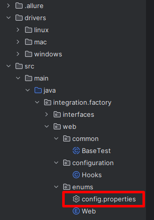

<h1 align="center">Project Automation Web Test</h1>

</h1>
<p align="center">Test automation project using the techniques of the BDD methodology</p>


## Starting

To run the project, it will be necessary to install the following programs:

- [JDK 15: Required to run the Java project](https://www.oracle.com/java/technologies/javase/jdk13-archive-downloads.html)
- [Maven 3.6.3: Required for building the Java project](https://downloads.apache.org/maven/maven-3/3.6.3/binaries/apache-maven-3.6.3-bin.zip)
- https://allurereport.org/docs/gettingstarted-installation/

Don't forget to configure the environment variables for execution.
- [Tutorial for configuring environment variables](https://medium.com/beelabacademy/configurando-vari%C3%A1veis-de-ambiente-java-home-e-maven-home-no-windows-e-unix-d9461f783c26#:~:text=Bom%2C%20mas%20o%20que%20s%C3%A3o,arquivos%20necess%C3%A1rios%2C%20inclusive%20os%20bin%C3%A1rios.)
- [IntelliJ: For project development](https://www.jetbrains.com/pt-br/idea/)


Upon opening the project, execute the following command in the root folder to install dependencies:

```bash
mvn clean install 
```


## Execution using IDE

To run via IDE, simply right-click on RunTest and click "Run, RunTest."


## Execution using command line

In a terminal execute the command line:

```bash
mvn clean test 
```

# Browsers


**Note:** The code uses WebDriverManager for chromedriver. However, there might be cases where the chromebrowser lacks support, requiring a local version downgrade.

If you encounter issues with Chrome, consider switching to FIREFOX or EDGE.

**Browser Compatibility**

The code is adapted to seamlessly support the latest versions of FIREFOX, EDGE, and CHROME browsers. It is configured to run on both Mac and Linux operating systems.

**Customization**

If you wish to make any modifications, simply adjust the relevant variable in `src/main/configuration/hooks`


## Data

**Note:** All test-related data such as URL, username, and password are stored in the `config.properties` file to avoid exposure.

This file is located in the project's root directory and contains sensitive information used during testing.



## Screenshots

The code is adapted to screenshot in the final step from the scenario to attached in allure report , but the files are saved in the target/screenshot folder


## StatusReport
####  After running the scenarios, execute the command below inside the target folder to generate the AllureReports
```bash
allure generate --clean
allure open 
```
